# Gestión Agrícola · Agricultura de precisión

<p>
  
  
  
</p>

Aplicación web para una empresa de servicios agrícolas: registra las fincas de cada agricultor sobre el mapa, organiza los trabajos de maquinaria que se hacen en ellas y factura esos trabajos a partir de las horas reales.

Cubre el ciclo completo de un servicio con **tres perfiles que trabajan sobre los mismos datos**: el agricultor pide una labor, la administración asigna máquina y maquinista, el maquinista la ejecuta e imputa las horas, y la factura sale sola de esas horas.

<p align="center">
  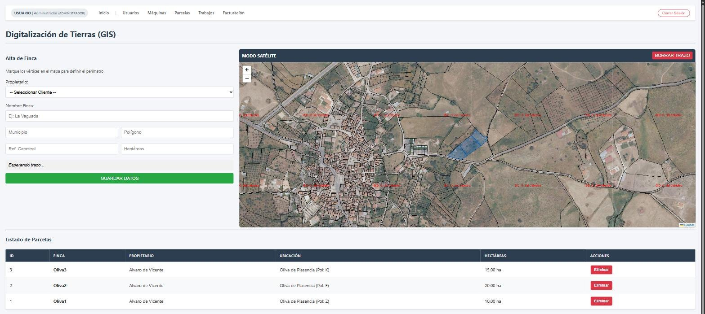
</p>

## Índice

1. [Cómo fluye un trabajo](#cómo-fluye-un-trabajo)
2. [Administración](#administración)
3. [Maquinista](#maquinista)
4. [Agricultor](#agricultor)
5. [Arquitectura y decisiones técnicas](#arquitectura-y-decisiones-técnicas)
6. [Siguientes mejoras](#siguientes-mejoras)
7. [Ejecutarlo en local](#ejecutarlo-en-local)

## Cómo fluye un trabajo

```
 Agricultor              Administración              Maquinista                 Agricultor           Administración
 solicita labor  ──▶   asigna máquina y   ──▶   inicia ──▶ finaliza    ──▶   solicita factura ──▶   emite factura ──▶ cobra
 (PENDIENTE)            maquinista               (EN CURSO)  (FINALIZADO,       (FACTURA SOLICITADA)   (FACTURADO)      (PAGADA)
                                                             imputa horas)
```

Cada trabajo guarda su estado (0 a 4) y cada perfil solo ve las acciones que le tocan en ese momento. Si se borra una factura, el trabajo vuelve a _finalizado_ para poder facturarlo de nuevo.

## Administración

### Panel de control

<p align="center">
  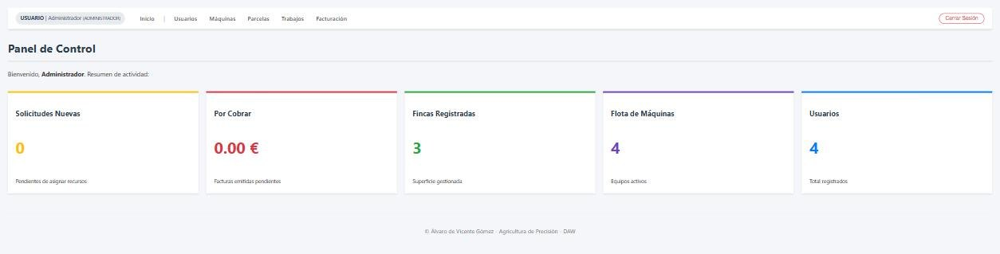
</p>

Resumen en tiempo real: solicitudes pendientes de asignar, importe por cobrar, fincas registradas, flota de máquinas y usuarios. El mismo `inicio.php` calcula métricas distintas según el perfil que entra.

### Parcelas sobre cartografía oficial

Ver la captura de arriba. El administrador da de alta cada finca **marcando sus vértices sobre el mapa**, con su propietario, municipio, polígono, referencia catastral y hectáreas.

**Cómo se resolvió.** El mapa es Leaflet con dos capas WMS oficiales superpuestas: la **ortofoto del PNOA** (IGN) como imagen de fondo y las **parcelas del Catastro** encima, de modo que las lindes reales sirven de guía para dibujar. El polígono se guarda en la base de datos como **GeoJSON**, y a partir de él se pintan las fincas en todos los mapas de la aplicación. No se puede borrar una parcela que ya tiene trabajos asociados.

### Usuarios y maquinaria

<p align="center">
  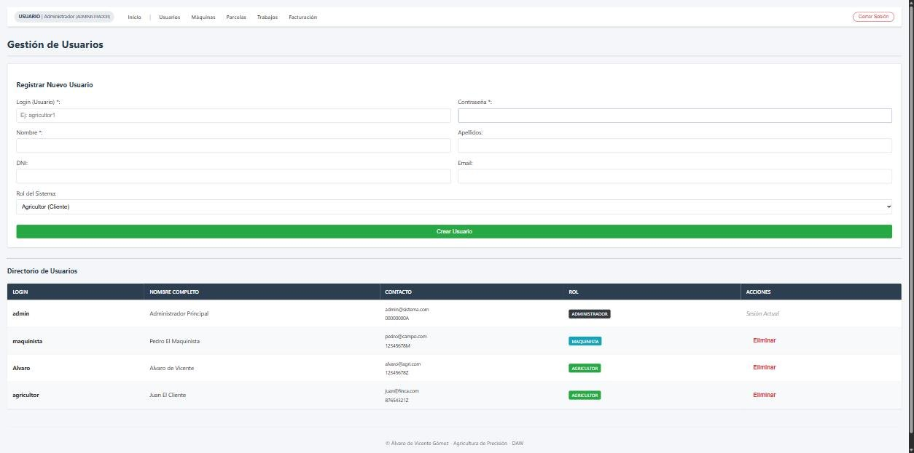
</p>

<p align="center">
  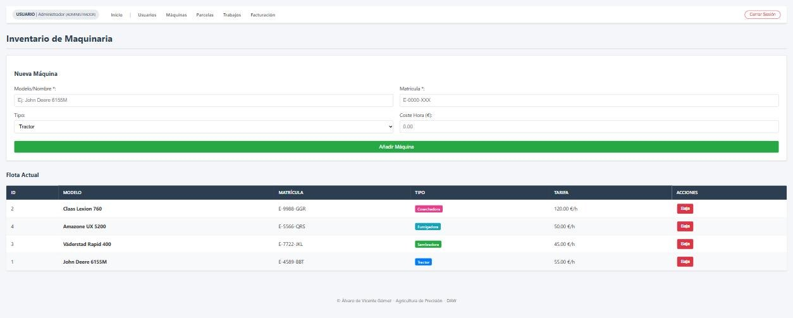
</p>

- **Usuarios:** alta con rol (administrador, maquinista o agricultor) y baja, comprobando antes que el login no exista y controlando los datos asociados para no romper la integridad referencial.
- **Maquinaria:** inventario de tractores, cosechadoras, sembradoras y fumigadoras con matrícula y **tarifa por hora**. Esa tarifa es la que después usa la facturación.

### Órdenes de trabajo

<p align="center">
  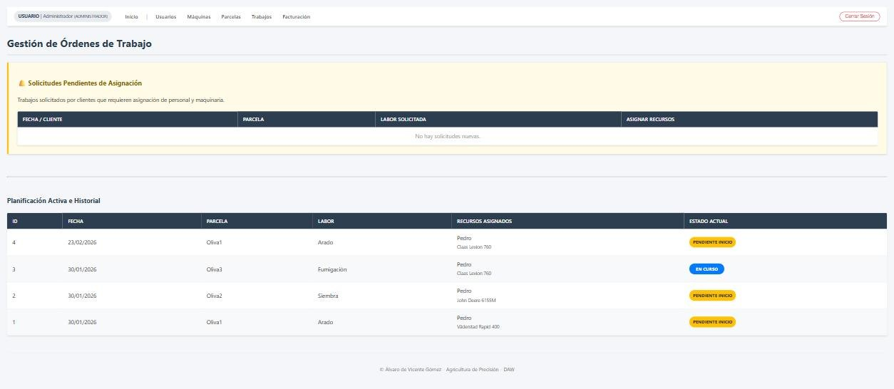
</p>

Arriba llegan las **solicitudes de los agricultores**; a cada una se le asigna un maquinista y una máquina. Debajo, la planificación activa y el historial con el estado de cada trabajo.

### Facturación

<p align="center">
  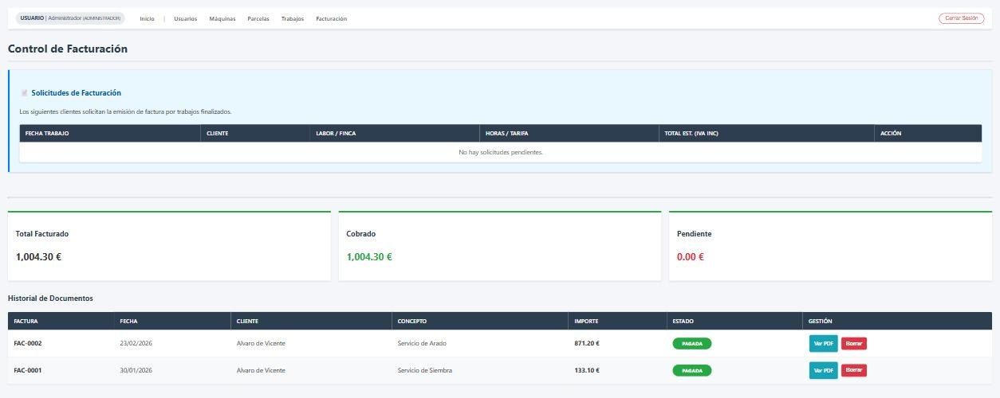
  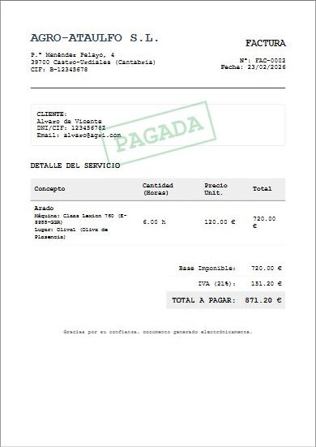
</p>

**Cómo se resolvió.** La factura no se escribe a mano: se calcula con las **horas reales imputadas por el maquinista × la tarifa por hora de la máquina usada**, más el **21 % de IVA**, uniendo trabajo y máquina en una sola consulta. El panel muestra lo facturado, lo cobrado y lo pendiente, y cada factura se marca como cobrada cuando se paga. La vista de factura es un documento **A4 con estilos de impresión** propios (`@media print`), sin menús, lista para imprimir o guardar en PDF.

## Maquinista

<p align="center">
  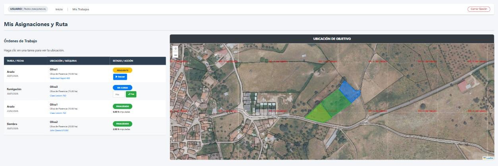
</p>

El maquinista solo ve **sus** órdenes de trabajo. Al pulsar una, el mapa **vuela hasta esa parcela** (`flyToBounds`). Desde la misma tabla inicia el trabajo y, al terminarlo, **imputa las horas reales**, que son las que después se facturan.

## Agricultor

<p align="center">
  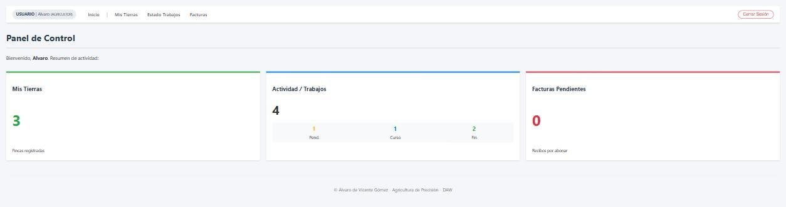
</p>

<p align="center">
  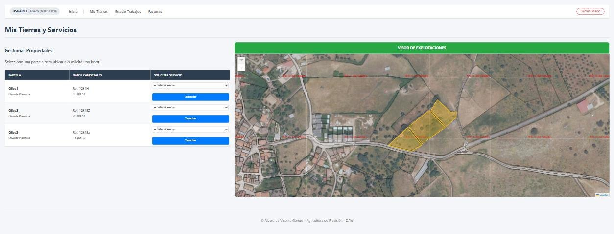
</p>

- **Mis tierras:** sus parcelas sobre la ortofoto, con los datos catastrales. Desde cada una **solicita un servicio** (arado, siembra, fumigación…), que llega como solicitud a la administración.
- **Seguimiento de operaciones:** el estado de cada trabajo, con la máquina y el operario asignados. Cuando uno termina, el agricultor **pide la factura** desde aquí.
- **Mis facturas:** su historial de cargos con el importe, el estado de pago y la factura en formato imprimible.

<p align="center">
  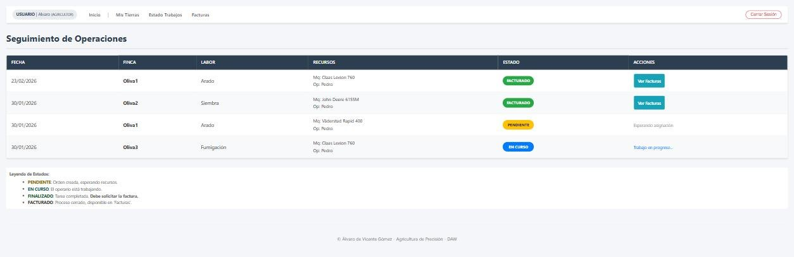
</p>

<p align="center">
  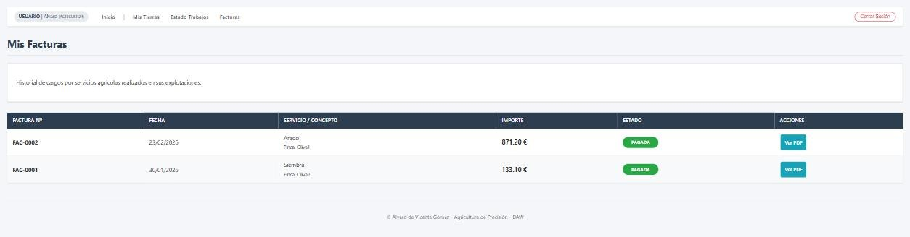
</p>

## Arquitectura y decisiones técnicas

- **PHP con MySQLi** y una página por módulo. Una cabecera y un menú comunes (`includes/header.php`, `menu.php`) montan la navegación según el rol de la sesión.
- **Control de acceso por rol en cada página:** si la sesión no corresponde al perfil de esa sección, se redirige al login. Ocultar el enlace del menú no bastaría.
- **Estados numéricos del trabajo (0-4)** como única fuente de verdad: los tres perfiles leen el mismo campo y cada pantalla decide qué acciones mostrar.
- **Cartografía sin coste:** servicios WMS públicos del IGN y del Catastro en lugar de proveedores de mapas de pago.
- **Geometrías en GeoJSON** guardadas junto a cada parcela, para reutilizarlas en todos los mapas sin recalcular nada.

**Stack:** PHP · MySQL · JavaScript · Leaflet · HTML5 · CSS3.

## Siguientes mejoras

Es un proyecto del ciclo y hay cosas que haría distinto hoy:

- Guardar las contraseñas con `password_hash` y comprobarlas con `password_verify`.
- Pasar todas las consultas a **sentencias preparadas**.
- Añadir protección CSRF a los formularios.

## Ejecutarlo en local

1. Crea la base de datos en MySQL con el script `database.sql`.
2. Revisa los datos de conexión en `conexion.php`.
3. Sirve la carpeta con Apache y PHP (por ejemplo, XAMPP) y abre `index.php`.
4. Entra con un usuario de prueba de cada perfil: `admin` / `admin` (administración), `maquinista` / `1234` y `agricultor` / `1234`.

---

Proyecto del ciclo de Desarrollo de Aplicaciones Web · [Álvaro de Vicente](https://github.com/AlvaroDEVicente)
